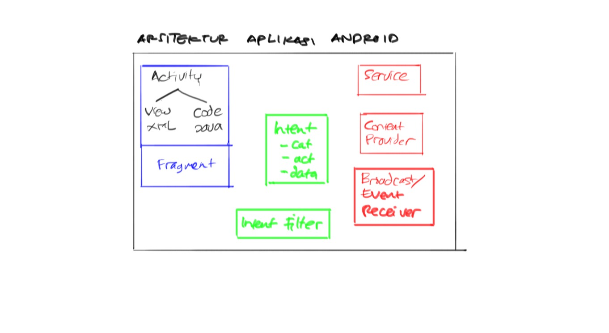

# Training Android 2016 #

Training membuat aplikasi Android.

## Materi training ##

* Arsitektur Aplikasi Android

    * Activity
    * Intent
    * Service
    * Content Provider
    * Broadcast Receiver

## Studi Kasus ##

Screen :

* Login
* Info Peserta
* Info Tagihan
* Detail Tagihan
* Setting Server URL

Backend Service :

* Login
* Logout
* Get daftar tagihan
* Post info peserta + upload 
* Input tagihan + notifikasi ke android

## Referensi ##

* [Website Resmi Android Programming](https://developer.android.com/index.html)

